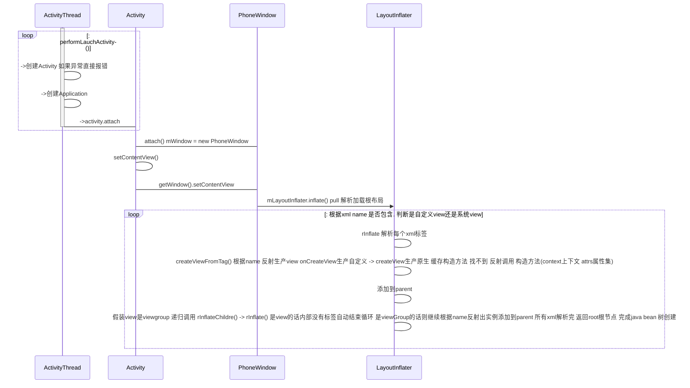
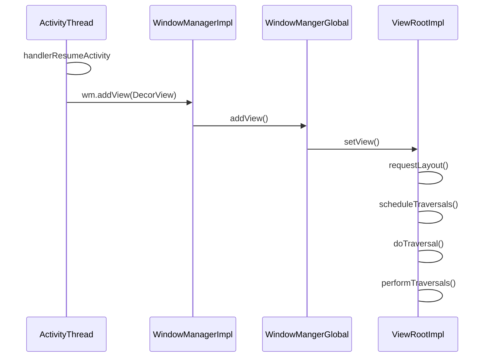

<a href = 'http://aospxref.com/android-8.1.0_r81/xref/frameworks/base/core/java/android/app/ActivityThread.java#2686'>app = ActivityClientRecord.PackageInfo.makeApplication</a>
<a>activity = Instrumentation.newActivity</a>

