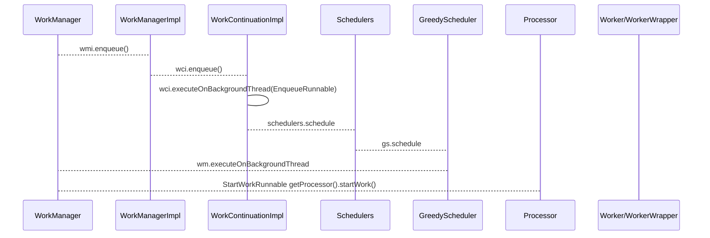

```java
//work约束
Constraints constraints = new Constraints.Buider().setRequiredNetworkType(NetworkType.CONNECTED) //网络连接中
.setRequiresCharging(true) //充电中
.setRequiresBatteryNotLow(true)//不是底电量
.setRequiresDeviceIdle(true) //空闲时
.setRequiresStorageNotLow(true) //非底存储
.build();

Data sendData = new Data.Builder().putString("key","valuse").build();
OnTimeWorkRequest oneTimeWorkRequest = new OneTimeWorkRequest.Builder(UploadWorker.classs).setConstraints(constraints)
.setInputData(snedData).build();
WorkManager.getInstance(this).getWorkInfoByIdLiveData(oneTimeWorkRequest.getId()).observe(this,new Observer<WorkInfo>(){
    workInfo.getOutputData()
});
WorkManager.getInstance(getApplicationContext()).enqueue(oneTimeWorkRequest);
//多任务并串行
WorkManager.getInstance(getApplicationContext()).beginWith(oneTimeWorkRequests)
.then(oneTimeWorkRequest);


public Result doWork(){
    final String data = workerParams.getInputData().getString("key");
    Data out = new Data.Builder().putString("result","123").build();
    return Result.Success(out);
}
```


