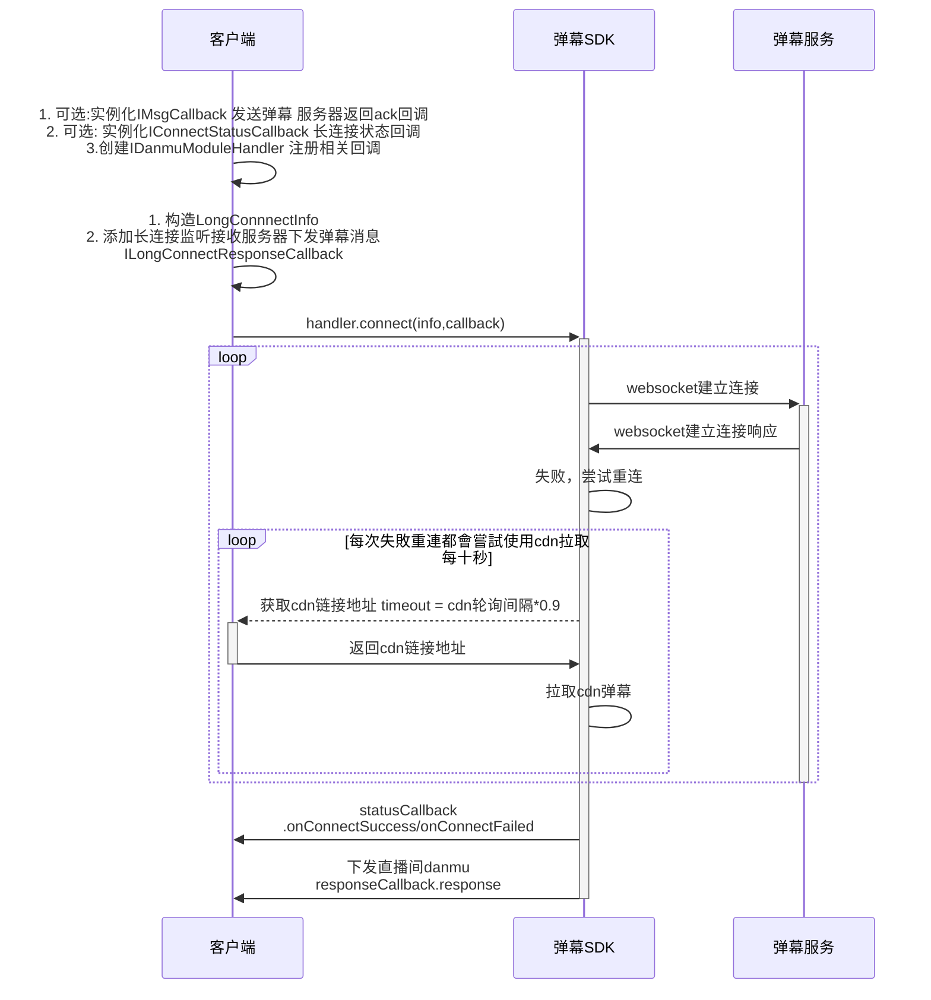
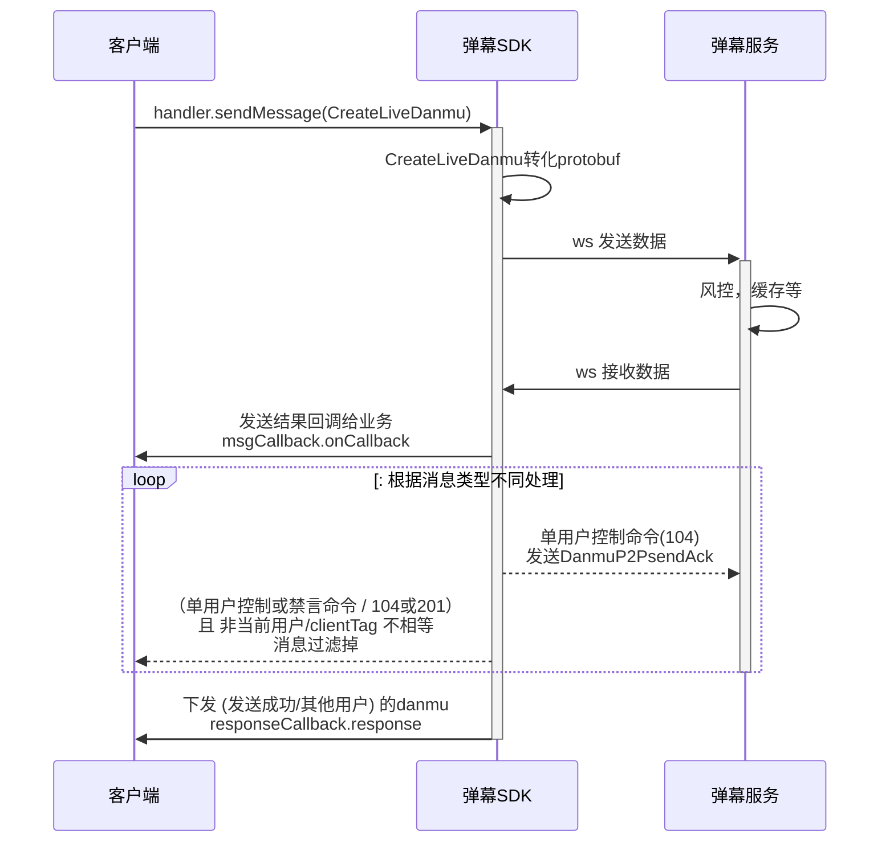
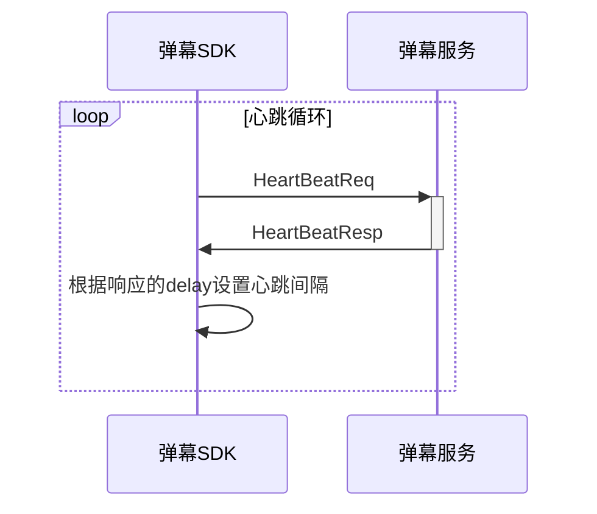
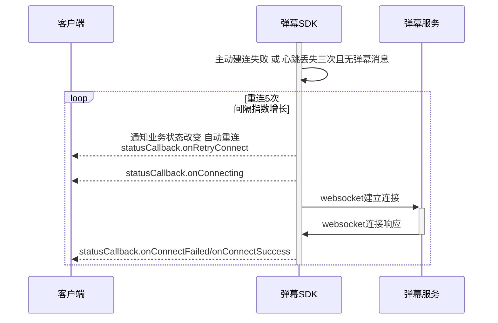
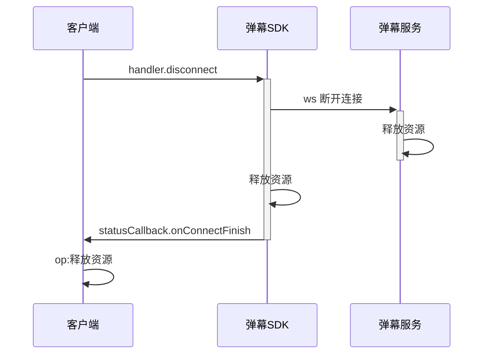

## 时序图

## 一、建立长连接

```mermaid
%% 时序图实验,-> 直线，-->虚线，->>实线箭头
%% 备注 1.HWDanmuHandler

sequenceDiagram
    participant c as 客户端
    participant sdk as 弹幕SDK
    participant s as 弹幕服务
    c->>c:<br>1. 可选:实例化IMsgCallback 发送弹幕 服务器返回ack回调<br>2. 可选: 实例化IConnectStatusCallback 长连接状态回调<br>3.创建IDanmuModuleHandler 注册相关回调
    c->>c:1. 构造LongConnnectInfo <br>2. 添加长连接监听接收服务器下发弹幕消息<br>ILongConnectResponseCallback
    c->>+sdk:handler.connect(info,callback)
    loop
    sdk->>+s: websocket建立连接
    s->>sdk: websocket建立连接响应
    sdk->sdk: 失败，尝试重连
        loop 每次失敗重連都會嘗試使用cdn拉取  每十秒
        sdk-->>+c: 获取cdn链接地址 timeout = cdn轮询间隔*0.9

        c->>-sdk: 返回cdn链接地址
        sdk->sdk: 拉取cdn弹幕
        end
    end 
    deactivate s
    sdk->>c: statusCallback<br>.onConnectSuccess/onConnectFailed
    sdk->>c: 下发直播间danmu<br>responseCallback.response
    deactivate sdk
```
## 二、发送弹幕

```mermaid
%% 时序图实验,-> 直线，-->虚线，->>实线箭头
sequenceDiagram
    participant c as 客户端
    participant sdk as 弹幕SDK
    participant s as 弹幕服务
    c->>+sdk:handler.sendMessage(CreateLiveDanmu)
    sdk->>sdk: CreateLiveDanmu转化protobuf 
    sdk->>+s: ws 发送数据
    s->>s: 风控，缓存等
    %% DanmuChannelHandler.channelRead
    s->>sdk: ws 接收数据
    sdk->>c: 发送结果回调给业务<br>msgCallback.onCallback
    loop: 根据消息类型不同处理
        sdk-->>s: 单用户控制命令(104)<br> 发送DanmuP2PsendAck
        sdk-->>c: （单用户控制或禁言命令 / 104或201）<br>且 非当前用户/clientTag 不相等<br> 消息过滤掉
    end
    deactivate s
    sdk->>c: 下发 (发送成功/其他用户) 的danmu<br>responseCallback.response
    deactivate sdk

```
## 三、心跳保活 
sdk内部实现 应用层不用关心

```mermaid
%% 时序图实验,-> 直线，-->虚线，->>实线箭头
sequenceDiagram
    participant sdk as 弹幕SDK
    participant s as 弹幕服务
    loop 心跳循环
        sdk->>+s: HeartBeatReq
        s->>-sdk: HeartBeatResp
        sdk->>sdk: 根据响应的delay设置心跳间隔
    end
```
## 四、重连机制 
sdk内部实现 应用层不用关心

```mermaid
%% 时序图实验,-> 直线，-->虚线，->>实线箭头
sequenceDiagram
    participant c as 客户端
    participant sdk as 弹幕SDK
    participant s as 弹幕服务
    	activate sdk
        sdk->>sdk:主动建连失败 或 心跳丢失三次且无弹幕消息
    loop 重连5次<br>间隔指数增长
        sdk-->>c: 通知业务状态改变 自动重连 <br>statusCallback.onRetryConnect
        sdk-->>c: statusCallback.onConnecting
        sdk->>+s: websocket建立连接
        s->>-sdk: websocket连接响应
        sdk-->>c: statusCallback.onConnectFailed/onConnectSuccess
    end
        deactivate sdk


```
## 五、断开长连接

```mermaid
%% 时序图实验,-> 直线，-->虚线，->>实线箭头
sequenceDiagram
    participant c as 客户端
    participant sdk as 弹幕SDK
    participant s as 弹幕服务
    c->>+sdk:handler.disconnect
    sdk->>+s:ws 断开连接
    s->>-s: 释放资源
    sdk->>sdk: 释放资源
    sdk->>c: statusCallback.onConnectFinish
    deactivate sdk
    c->>c: op:释放资源
```