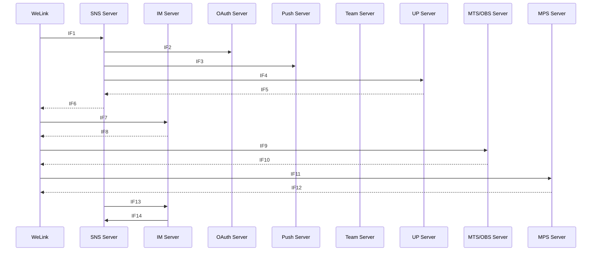
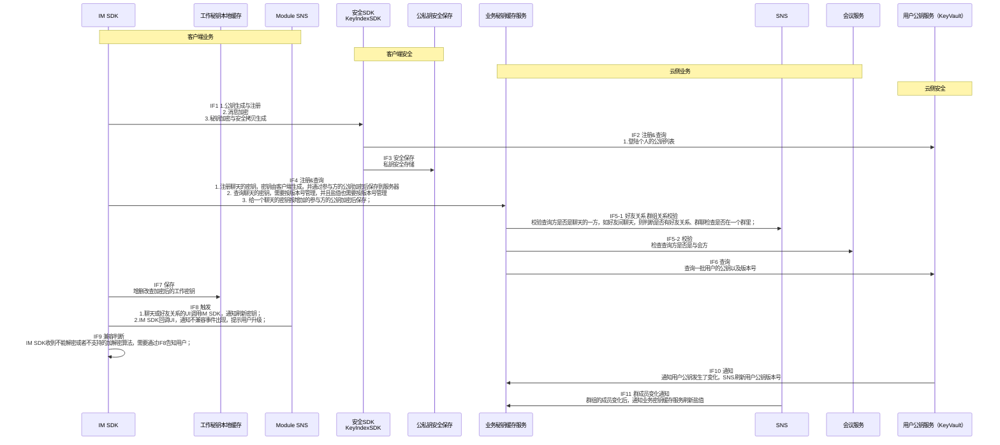

### DataFlow

```mermaid
sequenceDiagram
    participant app as WeLink
    %%社交服务器
    participant ss as SNS Server
    participant is as IM Server
    participant os as OAuth Server
    participant ps as Push Server
    %%团队服务器
    participant ts as Team Server
    %%账号服务器
    participant us as UP Server 
    %%图片、文件服务器
    participant mos as MTS/OBS Server
    %%系统通知号服务器
    participant ms as MPS Server
    app->>ss: IF1 
    ss->>os: IF2 
    ss->>ps:IF3 
    ss->>us:IF4
    us-->>ss:IF5
    ss-->>app:IF6
    app->>is:IF7
    is-->>app:IF8
    app->>mos:IF9
    mos-->>app:IF10
    app->>ms:IF11
    ms-->>app:IF12
    ss->>is:IF13
    is->>ss:IF14

```

```mermaid
sequenceDiagram
    participant is as IM SDK
    participant lc as 工作秘钥本地缓存
    participant ms as Module SNS

    participant ss as 安全SDK<br>KeyIndexSDK
    participant ks as 公私钥安全保存

    participant kc as 业务秘钥缓存服务
    participant s as SNS
    participant cs as 会议服务

    participant kv as 用户公钥服务（KeyVault）
    Note over is,ms:客户端业务
    Note over ss,ks:客户端安全
    Note over kc,cs:云侧业务
    Note over kv:云侧安全
    is->>ss:IF1 1.公钥生成与注册<br>2.消息加密<br>3.秘钥加密与安全拷贝生成
    ss->>kv:IF2 注册&查询<br>1.登陆个人的公钥列表
    ss->>ks:IF3 安全保存<br>私钥安全存储
    is->>kc:IF4 注册&查询<br>1.注册聊天的密钥，密钥由客户端生成，并通过参与方的公钥加密后保存到服务器<br>2. 查询聊天的密钥，需要按版本号管理，并且盐值也需要按版本号管理<br>3. 给一个聊天的密钥按增加的参与方的公钥加密后保存；
    kc->>s:IF5-1 好友关系 群组关系校验<br>校验查询方是否是聊天的一方，如好友间聊天，则判断是否有好友关系、群聊检查是否在一个群里；
    kc->>cs:IF5-2 校验<br>检查查询方是否是与会方
    kc->>kv:IF6 查询<br>查询一批用户的公钥以及版本号
    is->>lc:IF7 保存<br>增删改查加密后的工作密钥
    is->ms:IF8 触发<br>1.聊天或好友关系的UI调用IM SDK，通知刷新密钥；<br>2.IM SDK回调UI，通知不兼容事件出现，提示用户升级；
    is->>is:IF9 兼容判断<br>IM SDK收到不能解密或者不支持的加解密算法，需要通过IF8告知用户；
    kv->>kc:IF10 通知<br>通知用户公钥发生了变化，SNS刷新用户公钥版本号
    s->>kc:IF11 群成员变化通知<br>群组的成员变化后，通知业务密钥缓存服务刷新盐值


```