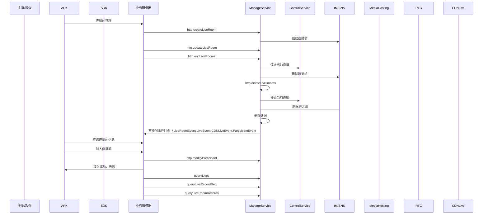

```mermaid
%% 时序图实验,-> 直线，-->虚线，->>实线箭头
sequenceDiagram
    participant c as 主播/观众
    participant a as APK
    participant s as SDK
    participant bs as 业务服务器
    participant ms as ManageService
    participant cs as ControlService
    participant i as IM/SNS
    participant mh as MediaHosting
    participant r as RTC
    participant cdn as CDNLive

    a->>bs:直播间管理
    bs->>ms:http createLiveRoom
    ms->>i:创建直播群
    bs->>ms:http updateLiveRoom
    bs->>ms:http endLiveRooms
    ms->>cs:停止当前直播
    ms->>i:删除聊天组
    ms->>ms:http deleteLiveRooms
    ms->>cs:停止当前直播
    ms->i:删除聊天组
    ms->>ms:删除数据

    ms->>bs:直播间事件回调（LiveRoomEvent,LiveEvent,CDNLiveEvent,ParticipantEvent
    a->>bs:查询直播间信息
    a->>bs:加入直播间
    bs->>ms:http modifyParticipant
    bs->>a:加入成功、失败
    bs->>ms:queryLives
    bs->>ms:queryLiveRecordReq
    bs->>ms:queryLiveRoomRecords
```

```mermaid
%% 时序图实验,-> 直线，-->虚线，->>实线箭头
sequenceDiagram
    participant c as 主播/观众
    participant a as APK
    participant s as SDK
    participant bs as 业务服务器
    participant ms as ManageService
    participant cs as ControlService
    participant i as IM/SNS
    participant mh as MediaHosting
    participant r as RTC
    participant cdn as CDNLive
    c->>a:主播观众加入直播间
    opt: joinType = ONLY_INVITED
        a->>bs:加入直播间
        bs->>ms:http modifyParticipant
    end
    a->>s:加入直播间
    s->>cs:http 20001 joinLiveRoom
    cs->>ms:校验直播间鉴权
    cs->>i:用户加入群组
    cs->>s:ws|im 20002 joinLiveRoomNotify
    s->>a:加入直播间回调
    s->>i:注册
    s->>i:订阅群组消息
    s->>cs:ws|http 10028  queryLiveRoomParticipant
    alt: 直播已开始
        s->>cs:ws|http 10006 queryLive
        s->>cs:ws|http 10007 listParticipants
    else: CDN直播已开始
        s->>cs:ws|http 10027 queryCdnLive
        s->>cdn: play(url)
    end
    alt: 周期发送心跳
        s->>cs:http 20030 heartBeat
    else: 长时间无心跳
        cs->>cs:长时间无心跳信息
        cs->>s:ws|im 20008 exitLiveRoomNotify
        s->>a:离开直播间
    end
    
    c->>a:RTC 用户加入直播
    a->>s:加入直播
    s->>cs:ws 20003 joinLive
    cs->>ms: 角色检查 business role
    opt: 当前无直播
        cs->>cs:创建直播
        cs->>ms:创建直播
        ms->>bs:SCB 通知开始直播
    end
    opt: 直播开启录制
        cs->>cs:创建录制任务
    end
    cs->>i:用户加入群组
    cs->>s:ws|im 20004 joinLiveNotify
    s->>a:加入直播回调
    cs->>bs:SCB 通知加入直播
    s->>r:加入RTC
    s->>cs:ws 10006 queryLive
    s->>cs:ws 10007 listParticipants
    s->>cs:ws 20009 reportParticipantStatus
    cs->>s:ws|im 20010 reportParticipantStatusNotify
    s->>a:rtc 用户状态变更回调
    opt: 没有加入过直播间
        s->>i:注册
        s->>i:订阅群组消息
    end
    c->>a:主播开始CDN直播
    a->>s:开始CDN直播streamIds
    s->>cs:ws|http 10027 queryCdnLive pushInfo
    alt: 端侧推流
        s->>r:设置CDN直播
        r->>cdn:推流
    else: 云侧推流
        s->>cs:ws 10021 updateCdnLive
        cs->>r: 1
        r->>cdn: 推流
    end
    s->>cs:ws 10019 startCdnLive streamIds
    cs->>ms:开始CDN直播
    ms->>bs:SCB 开始CDN直播
    ms->>mh:开始直播风控
    opt:云侧自动推流场景
        ms->>r:设置CDN直播转码
        r->>cdn:推流
    end
    ms->>s:ws|im 10020 startCdnLiveNotify
    s->>a:cdn直播开始回调

    opt: rtc用户刷新rtc token
        r->>s:tokenWillExpired
        s->>cs:ws 10024 refreshRtcInfo
        s->>r:refreshToken
    end

    c->>a:暂停CDN直播
    a->>s:暂停CDN直播
    s->>cs:ws 10025 pauseLive
    cs->>s:ws 10026 pauseLiveNotify
    s->>a:暂停cdn直播通知

    c->>a:恢复CDN直播
    a->>s:恢复CDN直播
    s->>cs:ws 10025 pauseLive
    cs->s:ws 10026 pauseLiveNotify
    s->>a:恢复CDN直播

    c->>a:停止CDN直播   
    a->>s:停止CDN直播
    alt:端侧推流
        s->>r:停止推流
    else:云侧推流
        s->>cs:停止推流
        cs->>r:停止推流
    end
    s->>cs:ws 10022 stopCdnLive
    cs->cm:停止cdn直播
    cm->>bs:SCB 停止cdn直播

    opt:自动推流
        cs->>r:停止推流
    end
    cs->>s:ws|im 10023 stopCdnLiveNotify
    s->>a:通知cdn 直播停止

    c->>a:主播邀请连麦
    a->>s:邀请连麦
    s->>cs:ws 50001 inviateLinkMic
    cs->>cs:记录连麦邀请信息
    cs->>s:ws|im 50002 inviateLinkMicNotify
    s->>a:邀请连麦通知

    c->>a:观众反馈邀请结果
    a->>s:邀请结果确认
    s->>cs:ws|http 50003 inviateLinkMicResult
    cs->>cs:检查并清除邀麦记录
    cs->>cs:记录上麦权限
    cs->>s:ws 50004 inviateLinkMicResultNotify
    s->>a:邀请连麦结果通知
    opt:观众同意连麦
        s->>cs:ws 50005 joinLinkMic
        s->>cs:ws 10006 queryLive
        s->>cs:ws 10007 listParticipants
        s->>r:加入rtc/推流
        s->>cs:ws 50006 reportLinkMicStatus
        cs->>s:ws|im 50007 reportLinkMicStatusNotify
        s->>a:通知用户连麦
        a->>s:主播更新cdn直播转码
        s->>cs:ws|http 10027 queryCdnLive
        alt: 端推流
            s->>r:更新直播转码
        else: 云推流
            s->>cs:ws 10021 updateCdnLive
            cs->>r:设置推流
        end
    end
    opt:连麦用户刷新rtc token
        r->>s:tokenWillExpired
        s->>cs:ws 50015 refreshRtcInfo
        s->>r:refresh token
    end

    c->>a:观众申请连麦
    a->>s:申请连麦
    s->>cs:ws|http 50008 applyLinkMic
    cs->>cs:记录申请标识
    cs->>s:ws 50009 applyLinkMicNotify
    s->>a:申请连麦通知

    c->>a:主持人反馈申请结果
    a->>s:申请结果确认
    s->>cs:ws 50012 applyLinkMicResult
    cs->>cs:记录连麦申请结果确认记录
    cs->>s:ws|im 50013 applyLinkMicResultNotify
    s->>a:申请结果确认回调
    

    c->>a:主播终止连麦
    a->>s:更新连麦直播画面
    s->>cs:ws|http 10027 queryCdnLive
    alt:端侧推流
        s->>r:更新旁路推流
    else:云侧推流
        s->>cs:ws 10021 updateCdnLive
        cs->>r:更新旁路推流
    end
    a->>s:终止连麦
    s->>cs:ws 50010 abortLinkMic
    cs->>cs:清除连麦信息
    cs->>r:云侧踢人 cdn连麦者
    cs->>s:ws 50011 abortLinkmicNotify
    s->>a:连麦结束

    alt:cdn观众
        s->>cs:ws 20005 exitLive
        cs->>s:ws 20006 exitLiveNotify
        s->>a:退出直播通知
        s->>cs:ws|http 10027 queryCdnLive
        s->>cdn:play
    else:rtc观众
        s->>r:stopPushStream
        s->>r:modifyRole
        s->>r:refreshToken
    end

    cs->>s:ws|im 50007 reportLinkMicStatusNotify
    s->>a:观众连麦状态通知

    c->>a:观众停止连麦
    a->>s:停止连麦
    s->>cs:ws 50014 stopLinkMic
    cs->>cs:清除连麦信息
    cs->>r:云侧踢人 cdn观众
    cs->>s:ws|im 50007 reportLinkMicStatusNotify
    s->>a:通知用户连麦状态
    a->>s:主播更新cdn直播转码
    alt:端侧推流
        s->>r:更新直播转码
    else:云侧推流
        s->>cs:ws 10021  updateCdnLive
        cs->>r:更新直播转码
    end

    alt:cdn观众
        s->>cs:ws 20005 exitLive
        cs->>s:ws 20006 exitLiveNotify
        s->>a:退出直播通知
        s->>cs:ws|http 10027 queryCdnLive
        s->>cdn:play()
    else:rtc观众
        s->>r:stopPushStream
        s->>r:modifyRole
        s->>r:refreshToken
    end
    mh->>cm:直播风控问题
    cm->>bs:直播风控

    c->>a:停止直播
    a->>s:停止直播
    s->>cs:ws 10002 endLive
    cs->>r:踢出所有rtc成员
    cs->>cm:终止直播
    cm->>bs:SCB 停止直播
    cm->>cm:直播录制托管
    cm->>bs:SCB 直播录制结束
    cs->>s:ws|im 10003 endLiveNotify
    s->>a:直播停止

    c->>a:退出直播
    a->>s:退出直播
    s->>cs:ws|http 20005 exitLive
    cs->>s:ws|im 20006 exitLiveNotify
    s->>a:退出直播通知
    opt:退出直播同时退出直播间
        cs->>i:退出群组
        cs->>s:ws|im 20008 exitLiveRoomNotify
        s->>a:退出直播间通知
    end

    opt:主播长时间不在直播间自动停止直播
        cs->>cs:停止直播
    end

    c->>a:退出直播间
    a->>s:退出直播间
    s->>cs:ws|20007 exitLiveRoom
    opt: rtc 人员退出直播间
        cs->>cs:退出直播
        cs->>s:ws|im 20006 exitLiveNotify
    end
    cs->>i:退出群组
    cs->>s:ws|im 20008 exitLiveRoomNotify
    s->>a:退出直播间通知

    c->>a:踢人
    a->>s:踢人
    s->>cs:ws|http 20011 kickOff
    cs->>cs: ttl>0
    cs->>ms:加入黑名单
    cs->>cs:异步踢人
    cs->>r:云侧rtc踢人
    cs->>i:从群组中删除
    cs->>s:ws|im 20012 kickOffNotify
    s->>a:被踢出通知
    s->>cs:ws|http 20005 exitLive

    c->>a:禁言
    a->>s:禁言
    s->>cs:ws|http 20026 muteChat
    cs->>cs:是否单场直播禁言
    cs->>ms:添加禁言黑名单
    cs->>i:群组禁言
    cs->>s:ws|im 20027 muteChatNotify
    s->>a:被禁言通知

    a->>s:查询黑名单
    s->>cs:ws|http 20028 queryBlockParticipants
    cs->>ms:queryBlockList

    a->>s:移除禁言
    s->>cs:ws|http 20019 removeBlockParticipants
    cs->ms:移除禁言黑名单
    cs->>i:移除禁言
    cs->>s:ws|im 20027 muteChatNotify
    s->>a:禁言取消通知

    a->>s:发送业务自定义消息
    s->>cs:ws 40001 sendAppData(data,userIds or group)
    cs->>s:ws|im 40002 sendAppDataNotify
    s->>a:业务自定义数据通知

    a->>s:发送业务自定义状态
    s->>cs:ws 40003 businessStatesChanged(data,userIds or group)
    cs->>s:ws|im 40004 businessStatesChangeNotify
    s->>a:业务自定义状态通知

    a->>s:主播邀请共享
    s->>cs:ws 30002 invitationDeskShare
    cs->>cs:记录邀请标识
    cs->>s:ws|im 30003 invitationDeskShareNotify
    s->>a:通知邀请桌面共享

    a->>s:观众申请共享
    s->>cs:ws 30004 applyDeskShare
    cs->>cs:记录申请标识
    cs->>s:ws|im applyDeskShareNotify
    s->>a:通知主播观众申请共享

    a->>s:主播同意观众共享
    s->>cs:ws 30006 deskShareAgree
    cs->>cs:记录同意共享标识
    cs->>s:ws|im 30007 deskShareAgreeNotify
    s->>a:通知观众主持人同意共享

    a->>s:开始共享
    s->>cs:ws 30001 startDeskShare 共享rtc信息
    s->>r:joinRTC
    s->>cs:ws 30013 reportDeskShareState
    cs->>s:ws|im 30014 reportDeskShareStateNotify
    s->a:通知开始桌面共享
    a->>s:开启桌面共享cdn直播
    s->>cs:ws|http 10027 queryCdnLive
    alt:端侧推流
        s->>r:设置rtc推流
    else:云侧推流
        s->>cs:ws|http 10021 updateCdnLive
        cs->>r:推流
    end
    s->>cs:ws 10019 startCdnLive streamIds
    cs->>s:ws|im 10020 startCdnLiveNotify
    s->>a:桌面共享cdn直播开始

    a->>s:停止桌面共享
    s->>cs:ws 30013 reportDeskShareState
    cs->>s:ws|im 30014 reportDeskShareStateNotify
    s->>a:通知桌面共享cdn直播停止
    alt:端侧推流
        s->>r:停止推流
    else:云侧推流
        s->>cs:ws|http 10021 updateCdnLive
        cs->>r:停止推流
    end
    s->>cs:ws 30008 endDeskShare

    a->>s:主持人终止桌面共享
    s->>cs:ws 10022 stopCdnLive
    cs->>s:ws|im 10023 stopCdnLiveNotify
    s->>a:通知桌面共享cdn 直播停止
    s->>cs:ws 30009 abortDeskShare
    cs->>cs:删除连麦信息
    cs->>r:踢人
    cs->>s:ws|im 30010 abortDeskShareNotify

    a->>s:主持人控制桌面共享开关
    s->>cs:ws 30011 allDeskShare
    cs->>s:ws|im 30012 allDeskShareNotify
    s->>a:通知桌面共享开关


```
