## 主持人
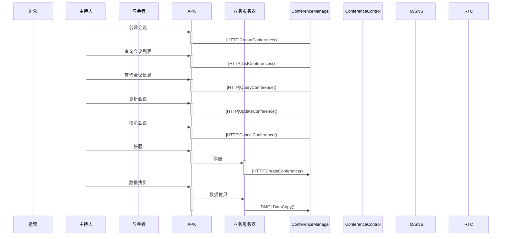
```mermaid
%% 时序图实验,-> 直线，-->虚线，->>实线箭头
sequenceDiagram
    participant o as 运营
    participant c as 主持人
    participant p as 与会者
    participant a as APK
    participant bs as 业务服务器
    participant cm as ConferenceManage
    participant cc as ConferenceControl
    participant i as IM/SNS
    participant r as RTC
    c->>+a: 创建会议
    a->cm: [HTTP]CreateConference()
    deactivate a
    c->>+a: 查询会议列表
    a->cm: [HTTP]ListConferences()
    deactivate a
    c->>+a: 查询会议信息
    a->cm: [HTTP]QueryConference()
    deactivate a
    c->>+a: 更新会议
    a->cm: [HTTP]UpdateConference()
    deactivate a
    c->>+a: 取消会议
    a->cm: [HTTP]CancelConference()
    deactivate a
    c->>+a: 停服
    a->>+bs: 停服
    deactivate a
    bs->>cm: [HTTP]CreateConference()
    deactivate bs
    c->>+a: 数据拷贝
    a->>bs: 数据拷贝
    bs->>cm: [DMQ] DataCopy()
    deactivate a 
```
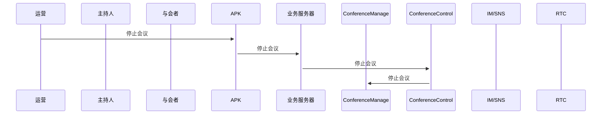
```mermaid
%% 时序图实验,-> 直线，-->虚线，->>实线箭头
sequenceDiagram
    participant o as 运营
    participant c as 主持人
    participant p as 与会者
    participant a as APK
    participant bs as 业务服务器
    participant cm as ConferenceManage
    participant cc as ConferenceControl
    participant i as IM/SNS
    participant r as RTC
    o->>+a: 停止会议
    a->>+bs: 停止会议
    bs->>+cc: 停止会议
    cc->>+cm: 停止会议
```
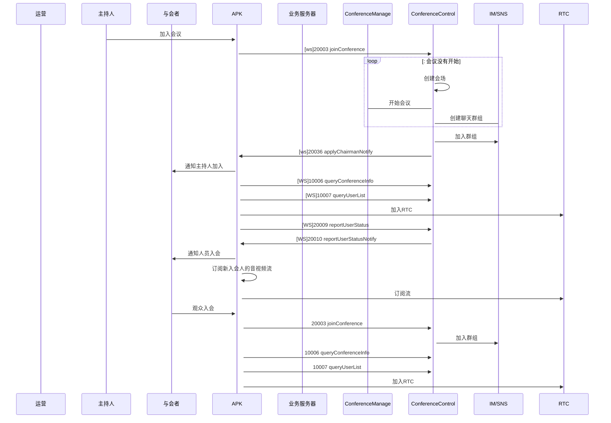
```mermaid
%% 时序图实验,-> 直线，-->虚线，->>实线箭头
sequenceDiagram
    participant o as 运营
    participant c as 主持人
    participant p as 与会者
    participant a as APK
    participant bs as 业务服务器
    participant cm as ConferenceManage
    participant cc as ConferenceControl
    participant i as IM/SNS
    participant r as RTC
    c->>+a: 加入会议
    a->>+cc: [ws]20003 joinConference
    loop: 会议没有开始
        cc->>cc:创建会场
        cc->cm:开始会议
        cc->i:创建聊天群组
    end
    cc->>i:加入群组
    cc->>+a:[ws]20036 applyChairmanNotify
    a->>p: 通知主持人加入
    a->>cc:[WS]10006 queryConferenceInfo
    a->>cc:[WS]10007 queryUserList
    a->>r:加入RTC
    a->>cc:[WS]20009 reportUserStatus
    cc->>+a:[WS]20010 reportUserStatusNotify
    a->>p:通知人员入会
    a->>a:订阅新入会人的音视频流
    a->>r:订阅流
    p->>+a:观众入会
    a->>+cc: 20003 joinConference
    cc->>i:加入群组
    a->>cc:10006 queryConferenceInfo
    a->>cc:10007 queryUserList
    a->>r:加入RTC
```
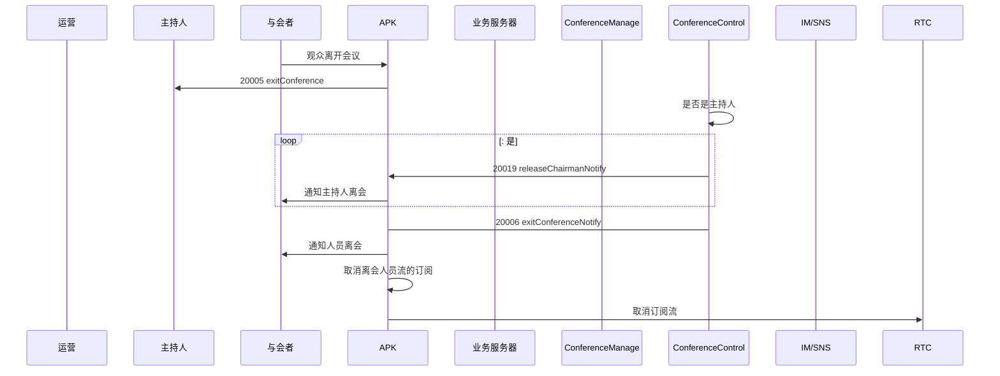
```mermaid
%% 时序图实验,-> 直线，-->虚线，->>实线箭头
sequenceDiagram
    participant o as 运营
    participant c as 主持人
    participant p as 与会者
    participant a as APK
    participant bs as 业务服务器
    participant cm as ConferenceManage
    participant cc as ConferenceControl
    participant i as IM/SNS
    participant r as RTC
    p->>a:观众离开会议
    a->>c:20005 exitConference
    cc->>cc:是否是主持人
    loop: 是
        cc->>a:20019 releaseChairmanNotify
        a->>p:通知主持人离会
    end
    cc->a:20006 exitConferenceNotify
    a->>p:通知人员离会
    a->>a:取消离会人员流的订阅
    a->>r:取消订阅流
```
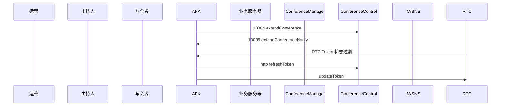
```mermaid
%% 时序图实验,-> 直线，-->虚线，->>实线箭头
sequenceDiagram
    participant o as 运营
    participant c as 主持人
    participant p as 与会者
    participant a as APK
    participant bs as 业务服务器
    participant cm as ConferenceManage
    participant cc as ConferenceControl
    participant i as IM/SNS
    participant r as RTC
    a->>cc:10004 extendConference
    cc->>a:10005 extendConferenceNotify

    r->>a:RTC Token 将要过期
    a->>cc: http refreshToken
    a->>r: updateToken
```
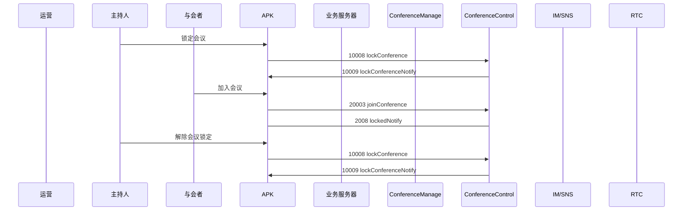
```mermaid
%% 时序图实验,-> 直线，-->虚线，->>实线箭头
sequenceDiagram
    participant o as 运营
    participant c as 主持人
    participant p as 与会者
    participant a as APK
    participant bs as 业务服务器
    participant cm as ConferenceManage
    participant cc as ConferenceControl
    participant i as IM/SNS
    participant r as RTC
    c->>a:锁定会议
    a->>cc:10008 lockConference
    cc->>a:10009 lockConferenceNotify

    p->>a:加入会议
    a->>cc:20003 joinConference
    cc->a:2008 lockedNotify

    c->>a:解除会议锁定
    a->>cc:10008 lockConference
    cc->>a:10009 lockConferenceNotify
```
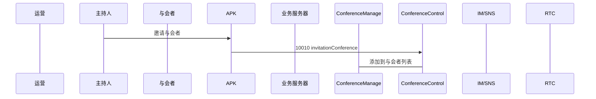
```mermaid
%% 时序图实验,-> 直线，-->虚线，->>实线箭头
sequenceDiagram
    participant o as 运营
    participant c as 主持人
    participant p as 与会者
    participant a as APK
    participant bs as 业务服务器
    participant cm as ConferenceManage
    participant cc as ConferenceControl
    participant i as IM/SNS
    participant r as RTC
    c->>a:邀请与会者
    a->>cc:10010 invitationConference
    cc->cm:添加到与会者列表
```
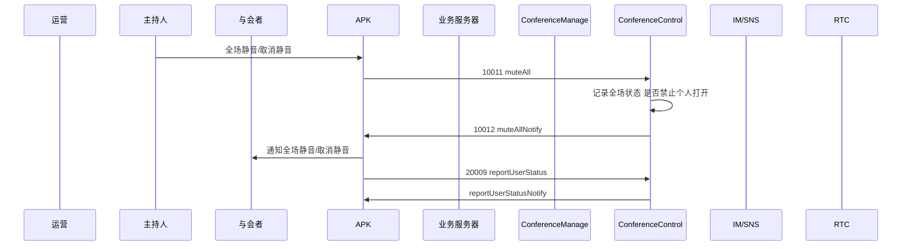
```mermaid
%% 时序图实验,-> 直线，-->虚线，->>实线箭头
sequenceDiagram
    participant o as 运营
    participant c as 主持人
    participant p as 与会者
    participant a as APK
    participant bs as 业务服务器
    participant cm as ConferenceManage
    participant cc as ConferenceControl
    participant i as IM/SNS
    participant r as RTC
    c->>a:全场静音/取消静音
    a->>cc:10011 muteAll
    cc->>cc:记录全场状态 是否禁止个人打开
    cc->>a:10012 muteAllNotify
    a->>p:通知全场静音/取消静音
    a->>cc:20009 reportUserStatus
    cc->>a:reportUserStatusNotify
```
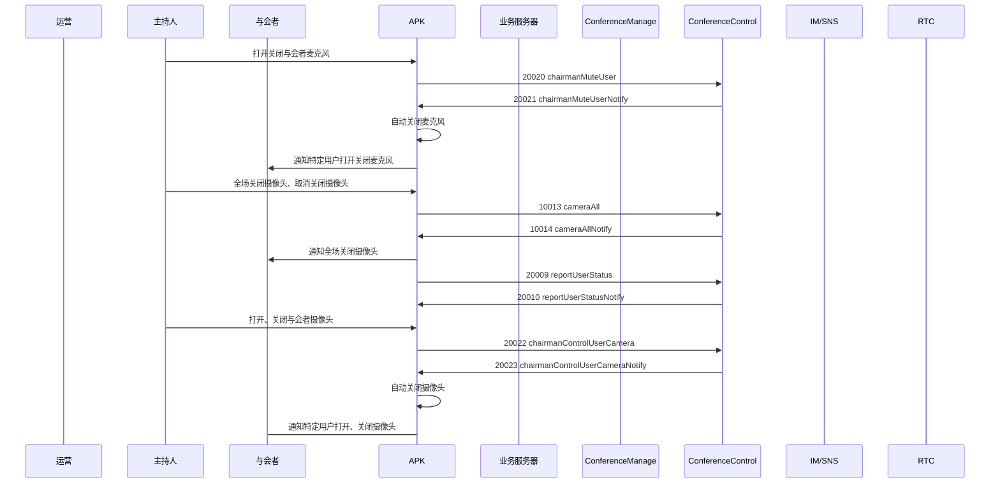
```mermaid
%% 时序图实验,-> 直线，-->虚线，->>实线箭头
sequenceDiagram
    participant o as 运营
    participant c as 主持人
    participant p as 与会者
    participant a as APK
    participant bs as 业务服务器
    participant cm as ConferenceManage
    participant cc as ConferenceControl
    participant i as IM/SNS
    participant r as RTC
    c->>a:打开关闭与会者麦克风
    a->>cc:20020 chairmanMuteUser
    cc->>a:20021 chairmanMuteUserNotify
    a->>a:自动关闭麦克风
    a->>p:通知特定用户打开关闭麦克风

    c->>a:全场关闭摄像头、取消关闭摄像头
    a->>cc:10013 cameraAll
    cc->>a:10014 cameraAllNotify
    a->>p:通知全场关闭摄像头
    a->>cc: 20009 reportUserStatus
    cc->>a: 20010 reportUserStatusNotify

    c->>a:打开、关闭与会者摄像头
    a->>cc:20022 chairmanControlUserCamera
    cc->>a: 20023 chairmanControlUserCameraNotify
    a->>a:自动关闭摄像头
    a->p:通知特定用户打开、关闭摄像头
```
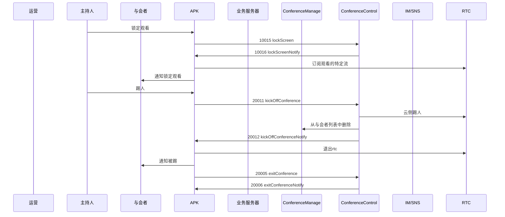
```mermaid
%% 时序图实验,-> 直线，-->虚线，->>实线箭头
sequenceDiagram
    participant o as 运营
    participant c as 主持人
    participant p as 与会者
    participant a as APK
    participant bs as 业务服务器
    participant cm as ConferenceManage
    participant cc as ConferenceControl
    participant i as IM/SNS
    participant r as RTC
    c->>a:锁定观看
    a->>cc:10015 lockScreen
    cc->>a:10016 lockScreenNotify
    a->>r:订阅观看的特定流
    a->>p:通知锁定观看

    c->>a:踢人
    a->>cc:20011 kickOffConference
    cc->>r:云侧踢人
    cc->>cm:从与会者列表中删除
    cc->>a:20012 kickOffConferenceNotify
    a->>r:退出rtc
    a->>p:通知被踢
    a->>cc:20005 exitConference
    cc->>a:20006 exitConferenceNotify
```
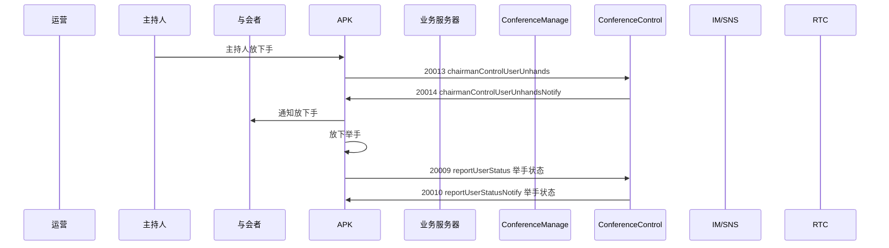
```mermaid
%% 时序图实验,-> 直线，-->虚线，->>实线箭头
sequenceDiagram
    participant o as 运营
    participant c as 主持人
    participant p as 与会者
    participant a as APK
    participant bs as 业务服务器
    participant cm as ConferenceManage
    participant cc as ConferenceControl
    participant i as IM/SNS
    participant r as RTC
    c->>a:主持人放下手
    a->>cc:20013 chairmanControlUserUnhands
    cc->>a:20014 chairmanControlUserUnhandsNotify
    a->>p:通知放下手
    a->>a:放下举手
    a->>cc:20009 reportUserStatus 举手状态
    cc->>a:20010 reportUserStatusNotify 举手状态
```
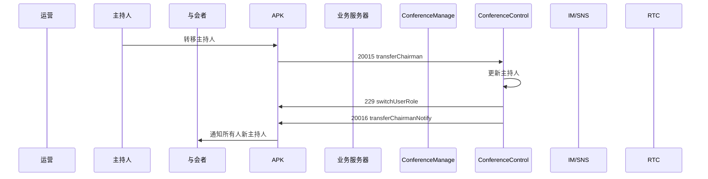
```mermaid
%% 时序图实验,-> 直线，-->虚线，->>实线箭头
sequenceDiagram
    participant o as 运营
    participant c as 主持人
    participant p as 与会者
    participant a as APK
    participant bs as 业务服务器
    participant cm as ConferenceManage
    participant cc as ConferenceControl
    participant i as IM/SNS
    participant r as RTC
    c->>a:转移主持人
    a->>cc:20015 transferChairman
    cc->>cc:更新主持人
    cc->>a:229 switchUserRole
    
    %% cc->>cm:更新会议信息
    
    cc->>a:20016 transferChairmanNotify
    a->>p:通知所有人新主持人
```
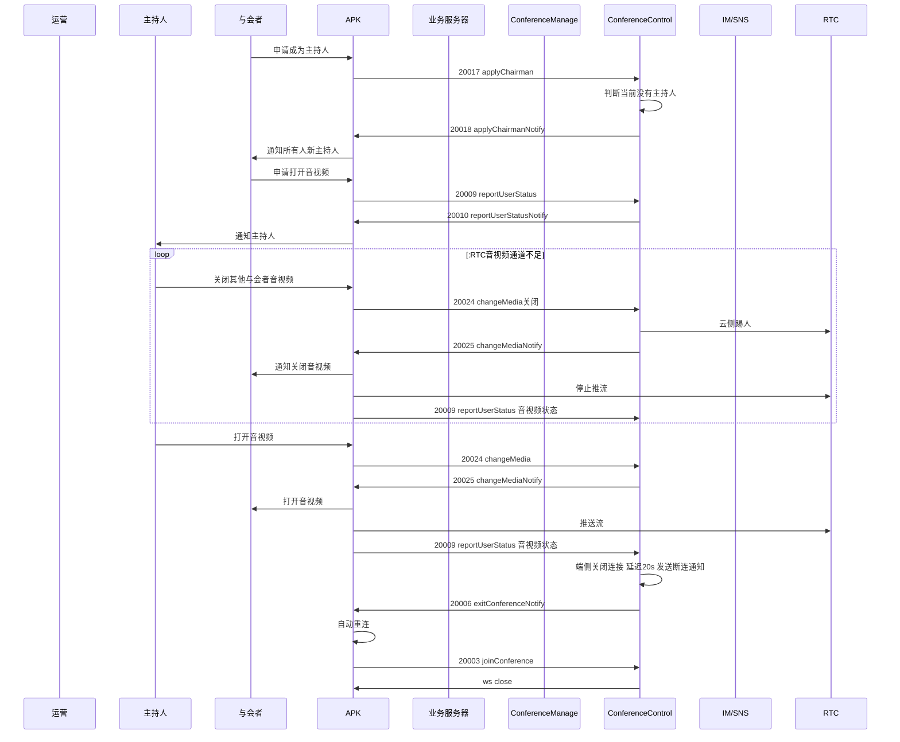
```mermaid
%% 时序图实验,-> 直线，-->虚线，->>实线箭头
sequenceDiagram
    participant o as 运营
    participant c as 主持人
    participant p as 与会者
    participant a as APK
    participant bs as 业务服务器
    participant cm as ConferenceManage
    participant cc as ConferenceControl
    participant i as IM/SNS
    participant r as RTC
    p->>a:申请成为主持人
    a->>cc:20017 applyChairman
    cc->>cc:判断当前没有主持人
    cc->>a:20018 applyChairmanNotify
    a->>p:通知所有人新主持人

    p->>a:申请打开音视频
    a->>cc:20009 reportUserStatus
    cc->>a:20010 reportUserStatusNotify
    a->>c:通知主持人
    loop:RTC音视频通道不足
        c->>a:关闭其他与会者音视频
        a->>cc:20024 changeMedia关闭
        cc->>r:云侧踢人
        cc->>a:20025 changeMediaNotify
        a->>p:通知关闭音视频
        a->>r:停止推流
        a->>cc:20009 reportUserStatus 音视频状态
    end
    c->>a:打开音视频
    a->>cc:20024 changeMedia
    cc->>a:20025 changeMediaNotify
    a->>p:打开音视频
    a->>r:推送流
    a->>cc:20009 reportUserStatus 音视频状态

    cc->>cc:端侧关闭连接 延迟20s 发送断连通知
    cc->>a:20006 exitConferenceNotify
    a->>a:自动重连
    a->>cc:20003 joinConference
    cc->>a:ws close

```
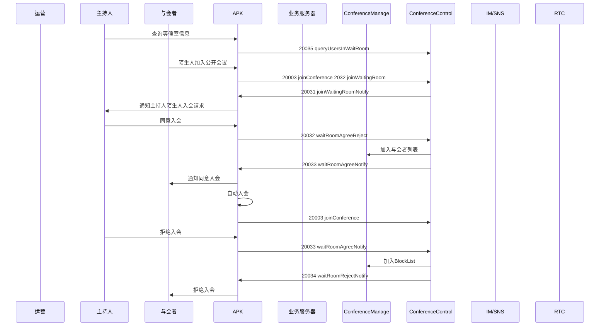
```mermaid
%% 时序图实验,-> 直线，-->虚线，->>实线箭头
sequenceDiagram
    participant o as 运营
    participant c as 主持人
    participant p as 与会者
    participant a as APK
    participant bs as 业务服务器
    participant cm as ConferenceManage
    participant cc as ConferenceControl
    participant i as IM/SNS
    participant r as RTC
    c->>a:查询等候室信息
    a->>cc:20035 queryUsersInWaitRoom
    p->>a:陌生人加入公开会议
    a->>cc:20003 joinConference 2032 joinWaitingRoom
    cc->>a:20031 joinWaitingRoomNotify
    a->>c:通知主持人陌生人入会请求

    c->>a:同意入会
    a->>cc:20032 waitRoomAgreeReject
    cc->>cm:加入与会者列表
    cc->>a:20033 waitRoomAgreeNotify
    a->>p:通知同意入会
    a->>a:自动入会
    a->>cc:20003 joinConference

    c->>a:拒绝入会
    a->>cc:20033 waitRoomAgreeNotify
    cc->>cm:加入BlockList
    cc->>a:20034 waitRoomRejectNotify
    a->>p:拒绝入会
```
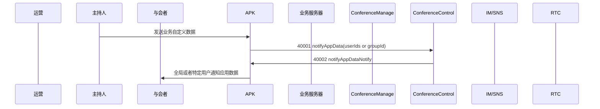
```mermaid
%% 时序图实验,-> 直线，-->虚线，->>实线箭头
sequenceDiagram
    participant o as 运营
    participant c as 主持人
    participant p as 与会者
    participant a as APK
    participant bs as 业务服务器
    participant cm as ConferenceManage
    participant cc as ConferenceControl
    participant i as IM/SNS
    participant r as RTC
    c->>a:发送业务自定义数据
    a->>cc:40001 notifyAppData(userIds or groupId)
    cc->>a:40002 notifyAppDataNotify
    a->>p:全局或者特定用户通知应用数据
```
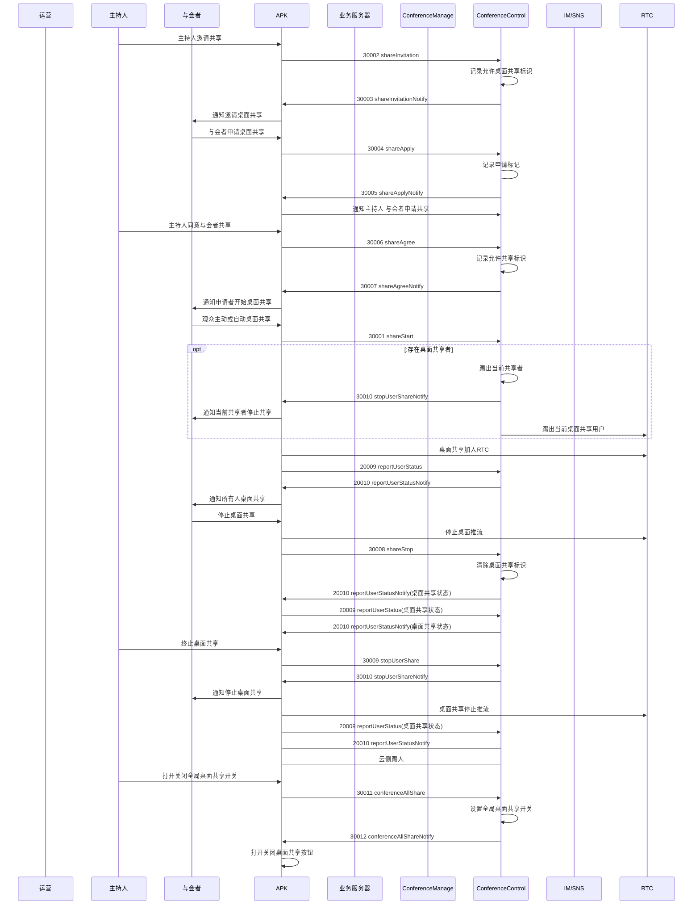
```mermaid
%% 时序图实验,-> 直线，-->虚线，->>实线箭头
sequenceDiagram
    participant o as 运营
    participant c as 主持人
    participant p as 与会者
    participant a as APK
    participant bs as 业务服务器
    participant cm as ConferenceManage
    participant cc as ConferenceControl
    participant i as IM/SNS
    participant r as RTC
    c->>a:主持人邀请共享
    a->>cc:30002 shareInvitation
    cc->>cc:记录允许桌面共享标识
    cc->>a:30003 shareInvitationNotify
    a->>p:通知邀请桌面共享

    p->>a:与会者申请桌面共享
    a->>cc:30004 shareApply
    cc->cc:记录申请标记
    cc->>a:30005 shareApplyNotify
    a->>cc:通知主持人 与会者申请共享

    c->>a:主持人同意与会者共享
    a->>cc:30006 shareAgree
    cc->>cc:记录允许共享标识
    cc->>a:30007 shareAgreeNotify
    a->>p:通知申请者开始桌面共享

    p->>a:观众主动或自动桌面共享
    a->>cc:30001 shareStart
    opt:存在桌面共享者
        cc->>cc:踢出当前共享者
        cc->>a:30010 stopUserShareNotify
        a->>p:通知当前共享者停止共享
        cc->>r:踢出当前桌面共享用户
    end
    a->>r:桌面共享加入RTC
    a->>cc:20009 reportUserStatus
    cc->>a:20010 reportUserStatusNotify
    a->>p:通知所有人桌面共享

    p->>a:停止桌面共享
    a->>r:停止桌面推流
    a->>cc:30008 shareStop
    cc->>cc:清除桌面共享标识
    cc->>a:20010 reportUserStatusNotify(桌面共享状态)
    a->>cc:20009 reportUserStatus(桌面共享状态)
    cc->>a:20010 reportUserStatusNotify(桌面共享状态)

    c->>a:终止桌面共享
    a->>cc:30009 stopUserShare
    cc->>a:30010 stopUserShareNotify
    a->>p:通知停止桌面共享
    a->>r:桌面共享停止推流
    a->>cc:20009 reportUserStatus(桌面共享状态)
    cc->a:20010 reportUserStatusNotify
    cc->a:云侧踢人

    c->>a:打开关闭全局桌面共享开关
    a->>cc:30011 conferenceAllShare
    cc->>cc:设置全局桌面共享开关
    cc->>a:30012 conferenceAllShareNotify
    a->>a:打开关闭桌面共享按钮
```
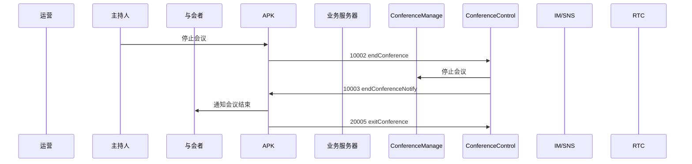
```mermaid
%% 时序图实验,-> 直线，-->虚线，->>实线箭头
sequenceDiagram
    participant o as 运营
    participant c as 主持人
    participant p as 与会者
    participant a as APK
    participant bs as 业务服务器
    participant cm as ConferenceManage
    participant cc as ConferenceControl
    participant i as IM/SNS
    participant r as RTC
    c->>a:停止会议
    a->>cc:10002 endConference
    cc->>cm:停止会议
    cc->>a:10003 endConferenceNotify
    a->>p:通知会议结束
    a->>cc:20005 exitConference
  
```